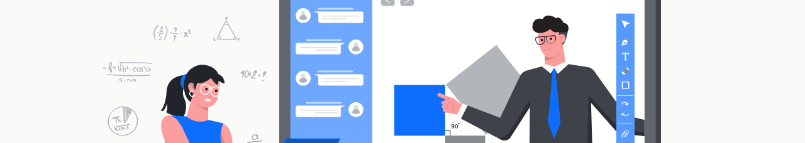

<!-- Start of Banner -->

<!-- End of Banner -->

<!-- Start of Heading -->

    <h1><b>SolvePy 🧮</b></h1>
    
<b>A web app for QSI and Simplex solvers on Flask and Python.</b> SolvePy is a project for CMSC 150 <i>(Numerical and Symbolic Computation).</i>

<!-- End of Heading -->

<!-- Start of Solvers -->
## **Solvers 🔹**
- **QSI Solver.** This is a generic solver using **Quadratic Spline Interpolation (QSI).** It displays the interpolating polynomials, intervals, and approximate value based on the given data.

- **Simplex Solver.** This is a generic solver using the **Simplex Method.** It displays the final tableau, basic solution, and maximized or minimized value based on the provided objective function and its constraints.

- **Problem Solver.** This is a problem-specific solver using the **Simplex Method.** Similar to its generic counterpart, it displays the final tableau, basic solution, and optimal value based on the data from the table. This also provides a table of the number of shipped items from each plant to each warehouse to follow the maximized or minimized cost.
<!-- End of Solvers -->

<!-- Start of Get Started -->
## **Get Started ⬇️**
This web app is deployed via **Heroku.** Visit the app at **https://solvepy.herokuapp.com/**.
<!-- End of Get Started -->