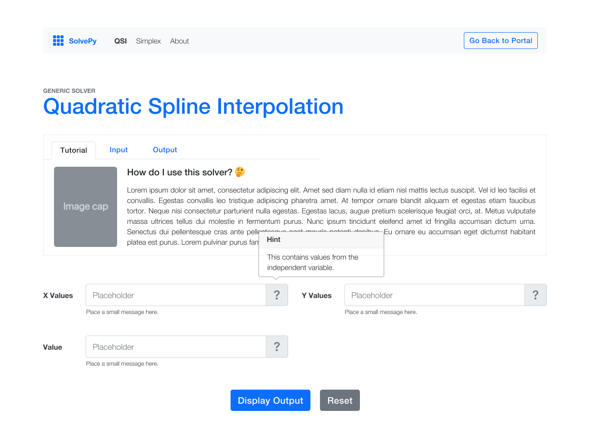

<!-- Banner -->

<!-- Header -->

  <h1><b>🧮 SolvePy</b></h1>
  
A web app that contains <b>QSI</b> (Quadratic Spline Interpolation) and <b>Simplex</b> solvers using Flask and Python.

 

<!-- App Preview -->
## 📱&ensp;App Preview

<!-- Solvers -->
## ✨&ensp;Solvers
<table>
  <!-- Column Names -->
  <thead>
    <tr>
      <th>Solver</th>
      <th>Input</th>
      <th>Output</th>
    </tr>
  </thead>

  <tbody>
  <!-- QSI Solver -->
  <tr>
    <td><b>QSI</b></td>
    <td>
      <ul>
        <li>X and Y values</li>
        <li>Value</li>
      </ul>
    </td>
    <td>
      <ul>
        <li>Interpolating polynomials</li>
        <li>Intervals <i>(based on the polynomials)</i></li>
        <li>Approximate value</li>
      </ul>
    </td>
  </tr>

  <!-- Simplex Solver -->
  <tr>
    <td><b>Simplex Method</b></td>
    <td>
      <ul>
        <li>Objective Function</li>
        <li>Constraints</li>
        <li>Method <i>(Max/Min)</i></li>
      </ul>
    </td>
    <td>
      <ul>
        <li>Optimal value</li>
        <li>Final tableau</li>
        <li>Basic solution</li>
      </ul>
    </td>
  </tr>

  <!-- Problem Solver -->
  <tr>
    <td><b>Simplex (Problem)</b></td>
    <td>
      <ul>
        <li>Demand <i>(Warehouse)</i></li>
        <li>Supply <i>(Plant)</i></li>
        <li>Cost <i>(Plant & Warehouse)</i></li>
        <li>Method <i>(Max/Min)</i></li>
      </ul>
    </td>
    <td>
      <ul>
        <li>Final tableau</li>
        <li>Basic solution</li>
        <li>Optimal cost</li>
        <li>Number of <b>shipped items</b> from a <i>plant</i> to a <i>warehouse</i> <b>(table)</b></li>
      </ul>
    </td>
  </tr>
  </tbody>
</table>
